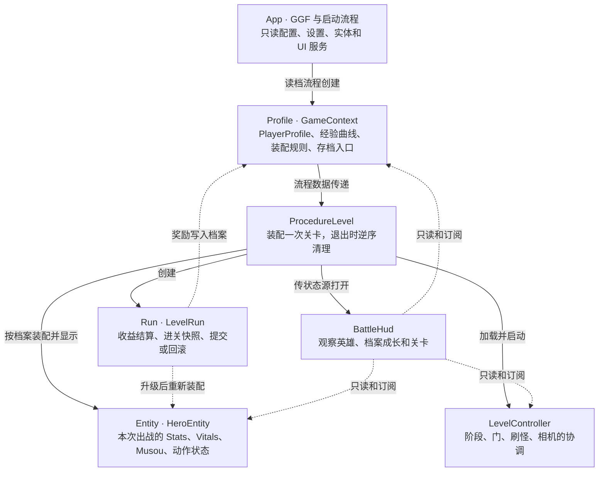
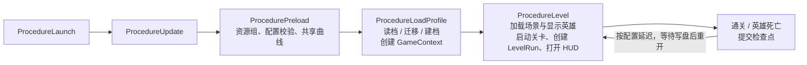
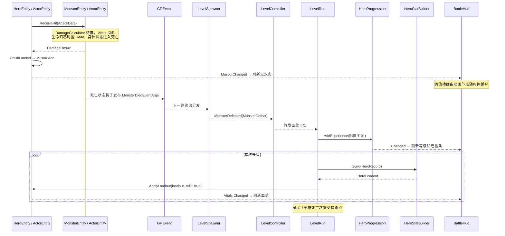
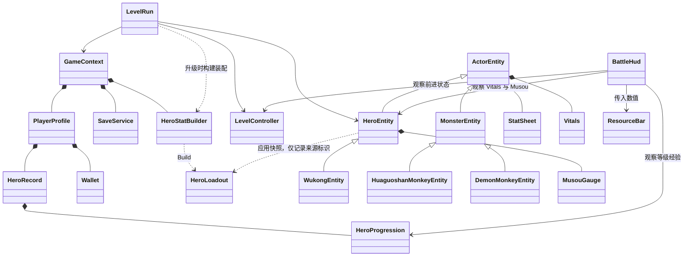

# GameZMXY：重构后项目导览

核对日期：2026-10-10。本文按当前业务代码整理，是阅读地图；唯一规范仍是 [ProjectGuidelines/AGENTS.md](ProjectGuidelines/AGENTS.md)。根 README 提供运行入口，`Godot/docs/` 用于查询 GGF API，其历史示例不代表当前游戏实现。

建议用 **作用域图 → 启动流程 → 一次击杀时序 → 局部类图** 熟悉项目，再沿着链接看代码。先回答“状态归谁、谁创建它、谁修改它、谁观察它”，就能判断新功能应放在哪里。图使用 Mermaid；支持 Mermaid 的 Markdown 预览可直接显示，下方表格和文字也可独立阅读。

项目的主干是 **GGF 分层 + 作用域所有权 + 显式依赖**：表现层是实体、UI 和关卡节点；应用层是流程、`GameContext` 与 `LevelRun`；领域层是档案和战斗状态；下面是纯规则、只读配置与 GGF。依赖向下，状态经所有者的方法修改，外部引用通过构造参数、`Initialize`、`userData` 或流程数据传入。领域状态与规则不反向访问场景树。

## 1. 先记住四个作用域（约 5 分钟）



实线表示创建或传递，虚线表示业务交互，不表示继承。`LevelRun` 使用流程注入的英雄和关卡；英雄由流程创建，怪物由刷怪服务创建并持有。

| 你关心的状态                 | 权威对象                                                    | 何时结束 / 是否存档       |
| ---------------------------- | ----------------------------------------------------------- | ------------------------- |
| 英雄累计经验、成长、金币     | `GameContext.Profile` → `HeroProgression` / `Wallet` | 档案作用域；检查点写盘    |
| 本关击败数、获得经验、结局   | `LevelRun.Stats` / `Outcome`                            | 一次关卡；统计不存档      |
| 当前血蓝、最终战斗属性、无双 | `ActorEntity.Stats/Vitals`、`HeroEntity.Musou`          | 实体 Show → Hide；不存档 |
| 当前阶段、可否前进           | `LevelStageSequence`、`LevelController.TravelAvailable` | 关卡会话；不存档          |
| 血条残影、满值闪烁           | `ResourceBar` 和它绑定的动画节点                          | UI 表现；窗口关闭复位     |

两个特别容易混淆的名字：**`LevelRun` 负责收益与事务，`LevelController` 负责关卡场景行为**；**`HeroProgression.Level` 是档案成长，实体 `Level` 是本次装配得到的战斗值**。

## 2. 跟一次启动（约 5 分钟）



当前入口直接进入第 1 关；地图、选人、结算界面仍待实现。中途离开或运行错误回滚到进关快照；通关和死亡保留本关收益。经验先进入内存档案，因此可以即时升级；不会每击杀一次就写盘。

按此顺序看，先读方法的 XML 摘要和装配顺序即可：

1. [ProcedureLoadProfile.OnEnter](../Godot/GodotProject/TheGame/MainPack/Scripts/Procedure/ProcedureLoadProfile.cs)：档案从哪里来，`GameContext` 怎样传给后续流程。
2. [ProcedureLevel.OnEnter / CleanupSession](../Godot/GodotProject/TheGame/MainPack/Scripts/Procedure/ProcedureLevel.cs)：谁创建英雄、关卡、运行和 HUD；失败与退出如何清理。
3. [GameContext](../Godot/GodotProject/TheGame/GameScripts/Session/GameContext.cs)：哪些对象跨关卡保留。
4. [LevelRun](../Godot/GodotProject/TheGame/GameScripts/Session/LevelRun.cs)：结算与存档时机。

## 3. 跟一次命中与击杀（约 8 分钟）

这条路径同时串起战斗、成长、UI 和关卡职责；无双来自**有效命中**，经验来自**击败奖励**。



对应代码入口：

| 步骤                     | 读这里                                                                                      | 看什么                                                   |
| ------------------------ | ------------------------------------------------------------------------------------------- | -------------------------------------------------------- |
| 命中去重、受击、死亡事实 | [ActorEntity](../Godot/GodotProject/TheGame/GameScripts/Entity/ActorEntity.cs)               | `OnHitBoxAreaEntered`、`ReceiveHit`、`ArmAttack`   |
| 无双收益                 | [HeroEntity](../Godot/GodotProject/TheGame/GameScripts/Entity/Heroes/HeroEntity.cs)          | `OnHitLanded` → `Musou.Add`                         |
| 伤害规则                 | [DamageCalculator](../Godot/GodotProject/TheGame/GameScripts/Battle/DamageCalculator.cs)     | 输入快照与外部随机值，输出结算结果                       |
| 怪物死亡结果             | [MonsterEntity](../Godot/GodotProject/TheGame/GameScripts/Entity/Monsters/MonsterEntity.cs)  | 发布`MonsterDiedEventArgs` 的钩子                      |
| 本关名额与击败事实       | [LevelSpawner](../Godot/GodotProject/TheGame/GameScripts/Level/Spawning/LevelSpawner.cs)     | `OnMonsterDied` 过滤本关实体、释放名额、报告击败与清波 |
| 奖励与升级装配           | [LevelRun](../Godot/GodotProject/TheGame/GameScripts/Session/LevelRun.cs)                    | `OnMonsterDefeated`、`Submit`、`Abandon`           |
| UI 观察                  | [BattleHud.Logic](../Godot/GodotProject/TheGame/GameScripts/UI/BattleHud/BattleHud.Logic.cs) | `OnOpen` 订阅并立即刷新，`Unbind` 退订和复位         |

通信只需分清三种：方法调用用于明确协作；对象的 `Changed` 表示状态变化，观察者重新读数；`GF.Event` 表示跨模块的一次性结果，参数是池化临时对象。它们的生命周期规则见 [00 架构](ProjectGuidelines/00-Architecture.md)。

## 4. 用局部 UML 记关系（约 5 分钟）

只画核心类型。`*--` 是持有状态，`-->` 是使用引用，`..>` 是临时构建或调用，`<|--` 是继承。实体应用不可变 `HeroLoadout` 后只记录本次登记的持久属性来源标识，用于下次替换装配；不保留装配输入或档案引用。



关卡内部再记一个分工表，排查“为什么下一波没开始”时尤其有用：

| 类型                   | 唯一主要职责                       | 代码                                                                                  |
| ---------------------- | ---------------------------------- | ------------------------------------------------------------------------------------- |
| `LevelController`    | 协调会话与阶段事件                 | [入口](../Godot/GodotProject/TheGame/GameScripts/Level/LevelController.cs)             |
| `LevelStageSequence` | 唯一当前阶段和合法迁移             | [入口](../Godot/GodotProject/TheGame/GameScripts/Level/Stage/LevelStageSequence.cs)    |
| `LevelStageGateSet`  | 物理门和阶段空间区域               | [入口](../Godot/GodotProject/TheGame/GameScripts/Level/Stage/LevelStageGateSet.cs)     |
| `LevelCamera`        | 实际视野、限位、抵达通知           | [入口](../Godot/GodotProject/TheGame/GameScripts/Level/Camera/LevelCamera.cs)          |
| `LevelSpawnSchedule` | 游戏时间、生成配方、并存名额       | [入口](../Godot/GodotProject/TheGame/GameScripts/Level/Spawning/LevelSpawnSchedule.cs) |
| `LevelSpawner`       | 创建并持有本关怪物，报告击败和清波 | [入口](../Godot/GodotProject/TheGame/GameScripts/Level/Spawning/LevelSpawner.cs)       |
| `LevelSpawnPointSet` | 稳定生成点 ID → 场景位置          | [入口](../Godot/GodotProject/TheGame/GameScripts/Level/Spawning/LevelSpawnPointSet.cs) |

普通阶段是 `Ready → Travelling → Fighting → Travelling / Completed`，清波后先放行，**实际相机抵达下一段右界**才刷下一波。怪物 AI 写移动和攻击意图，身体状态机在物理帧执行动作，动画值轨道提供画面与判定盒。

## 5. 开始改功能时查这张表

业务根目录为 `Godot/GodotProject/TheGame/GameScripts/`；流程在 `TheGame/MainPack/Scripts/Procedure/`。

| 想改什么                           | 首先打开                                                                                   | 归属判断                                            |
| ---------------------------------- | ------------------------------------------------------------------------------------------ | --------------------------------------------------- |
| 经验曲线、英雄成长、奖励、招式系数 | [Configs/GameConfig/Datas](../Configs/GameConfig/Datas/) 中对应 xlsx                        | 数值来自源表，按流程生成代码和二进制                |
| 伤害、属性汇总算法                 | `Battle/DamageCalculator.cs`、`Battle/Stats/StatSheet.cs`                              | 纯规则和战斗状态；确定性单测                        |
| 英雄/怪物动作、AI、具体招式行为    | `Entity/Heroes/WukongEntity.cs`、`Entity/Monsters/DemonMonkeyEntity.cs`                | 具体行为归具体实体及状态，先看抽象扩展点            |
| 波次、门、相机                     | `Level/` 对应职责 + `Scenes/Level_1.tscn` + `LevelConfig.xlsx`                       | 编排进表，空间在场景，状态各有一个所有者            |
| 血条、无双闪烁、前进提示           | `UI/BattleHud/BattleHud.Logic.cs`、`UI/Widgets/ResourceBar.cs`、`UIs/BattleHud.tscn` | 窗口观察状态，控件按输入显示；动画配置放场景        |
| 关内收益、通关或死亡处理           | `Session/LevelRun.cs`                                                                    | 关卡事务与检查点                                    |
| 背包、装备等持久状态               | `Profile/` + `Save/` + [长期系统落位](ProjectGuidelines/60-GameplayModules.md)          | 新玩法尚未实现，按既定落位增加档案、DTO、映射和迁移 |
| 读档、版本兼容                     | `Save/SaveService.cs`、`SaveMigrator.cs`、`ProfileMapper.cs`                         | 业务只经 SaveService 写盘                           |
| 实体/UI 池化与 GGF API 行为        | [Godot/docs](../Godot/docs/README.md) 和框架实现                                            | 依赖只读；先定位和报告框架问题                      |

新增功能前写下三件事：**配置输入、可变状态所有者、生命周期边界**。然后在最近的现有模块扩展；UI 打开参数传状态源引用，跨关卡数据归档案，临时战斗数据归实体。

本次无双修复就是一个小例子：`HeroEntity.OnHitLanded → MusouGauge.Changed → BattleHud.RefreshMusou → ResourceBar.SetValue → 满值时播放 AnimatedSprite2D`。循环由引擎时间推进；消费、零上限、窗口关闭或改绑到未满英雄时停止并复位。没有把 UI 计时塞进领域状态。

无双方形光晕来自旧项目 PNG 帧内自带的黄色底色，旧场景也没有遮罩。正式 HUD 的 `hud_ws_flash.gdshader` 先将闪烁裁到圆内，再用首帧透明轮廓去掉底色，保留亮度变化。

在 Godot 中打开 `BattleHud.tscn`，选中 `MenuPanel/m_WsMax`，展开 **Material → Shader Parameters**：

| 参数             | 默认值     | 调整方式                                                                                      |
| ---------------- | ---------- | --------------------------------------------------------------------------------------------- |
| `clip_radius`  | 32         | 裁剪外半径，单位是 89×89 原图帧的像素；30～33 适合当前圆圈，缩小会让闪烁更集中，0 隐藏闪烁层 |
| `clip_center`  | (0.5, 0.5) | 单帧内的相对圆心，X 向右、Y 向下；图集切帧不影响该坐标                                        |
| `clip_feather` | 1          | 边缘向内羽化的像素宽度，0 为硬边；羽化始终不扩展到圆外                                        |

`EditorScripts/validate_musou_flash.gd` 使用真实 GPU 检查十张帧与五组参数，在 `.godot/validation/musou_flash.png` 保存对比。各行依次为原图、正式默认值、24px 半径、偏移圆心、硬边、零半径。

代码精简按职责判断，不按文件长短判断：

- `BodyFsm` 保留为 C# 14 扩展块，只提供 `fsm.Tick(dt)`。它负责物理帧调度、同帧状态切换与重新进入，`BodyState` 负责单个动作；查询直接使用 `IFsm.CurrentState`。
- 状态名、动画名、招式范围、沙包开关等测试专用接口从正式类型删除；测试观测与反射集中在 `MainPack/Scripts/Debug/SmokeInspection.cs`，纯 C# 单测直接读取自己创建的状态机。
- 具体怪物用 `spec with { Reach = reach }` 补充近战范围，避免手抄整个规格；继续由具体实体决定行为，不新增近战中间基类。
- `AttackReachReader`、`HeroStatBuilder`、存档映射与迁移类分别承担几何、成长、格式边界，继续独立；短 DTO 与状态类也不因行数少而合并。
- 正式预加载与独立场地共用 `MainPack/Scripts/Startup/GameResourceGroups.cs` 注册三类资源组，重复调用跳过已有组；不再各维护一套注册逻辑。
- `ResourceBar` 使用 `GameLogic.UI.Widgets` 命名空间；HUD 样板由场景绑定重新生成。流程包装 `ExperienceCurveVariable` 与 `GameContextVariable` 都放在 `Session/`，按类型命名独立文件。
- `HeroLoadout` 复制外层来源与各组修正，外部列表变化不会污染装配快照；实体只保存返回的来源标识，卸装不会误删 Buff。

框架左上角调试按钮由 `ProcedureLaunch` 通过 `GF.Debugger.ActiveWindow = false` 关闭，不修改框架实现。

## 6. 动手熟悉与验证

先运行 `TheGame/Scenes/TestArena.tscn`（Godot 中 F6），观察悟空和猴子的身体/AI 状态。该场地创建仅内存的临时档案，不读写玩家存档。再运行正式项目，结合第 3 节追一次击杀。

可在以下位置下断点：`ProcedureLevel.OnEnter`、`HeroEntity.OnHitLanded`、`LevelRun.OnMonsterDefeated`、`HeroProgression.AddExperience`、`BattleHud.RefreshMusou`、`LevelRun.Submit`。看一次调用栈通常比从头逐文件阅读更快。

常用命令从仓库根执行；这里只列入口，完整约束见 [50 框架与工具](ProjectGuidelines/50-FrameworkAndTools.md)：

```powershell
dotnet build Godot/GodotProject/GodotProject.csproj
dotnet test Tests/BattleTests
dotnet test Tests/ProfileTests
dotnet test Tests/LevelTests
python Tools/ProjectMaintenance/validate_game_references.py
& 'S:/Godot4/Godot4CSharp_console.exe' --headless --path Godot/GodotProject --quit-after 2400 -- --smoketest=ui
```

UI 烟测使用唯一的 `user://Validation/Ui/<随机 ID>` 存档目录；用 `SMOKE PASS/FAIL` 判断断言，同时单独检查退出错误。框架既有的退出异常登记在第 50 章，不能据此省略退出码或把失败算通过。

## 7. 阅读时的边界

- 当前实现和运行命令以根 README、集中规范和本导览为入口；框架文档中的猫角色、旧流程名等属于历史示例。
- `BattleHud` 使用 `GameLogic.UI` 是第 40 章的生成约定；被动控件按实际目录使用 `GameLogic.UI.Widgets`。
- 热更启动成功标记由 App 生命周期中的关卡流程实例保存，重新进关不重复标记；没有可变静态标记。
- 框架既有退出异常仍登记在第 50 章。业务断言通过与进程正常退出是两项独立结果。

后续维护以功能为单位更新对应图、代码链接和已实现状态；类图只保留主干关系，细节通过代码和局部图阅读。
