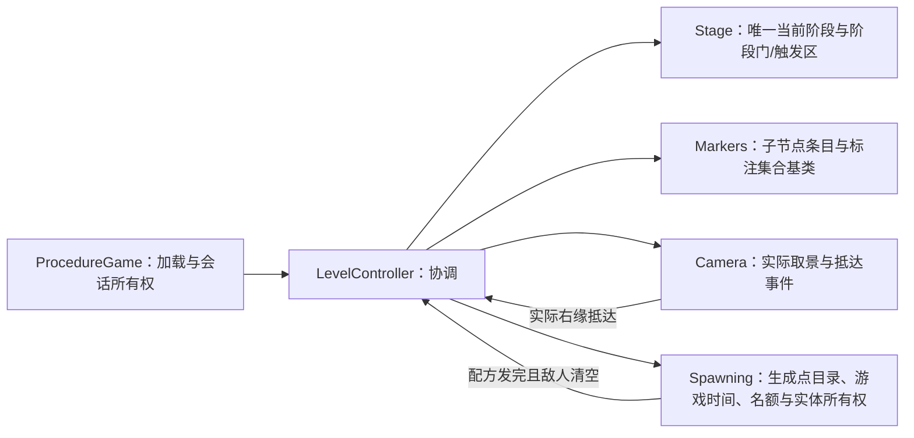

# 关卡工程重构与验证记录（2026-10-06）

本轮修复编辑器标注失效、清波后的相机跳变和过早刷怪，并整理业务脚本目录。关卡、英雄、怪物 AI 和在途取消四种真实 Godot 回归全部通过。规范正文仍只维护在 `Docs/ProjectGuidelines/`。

> 后续规范化轮（同日）：Level 目录细分为 `Stage/`、`Camera/`、`Markers/`、`Spawning/`；`LevelMonsterManager → LevelSpawner`、`LevelSpawnPointManager → LevelSpawnPointSet`、`LevelStageGateManager → LevelStageGateSet`、`LevelStageTriggerManager → LevelStageTriggerSet`、`LevelMarkerManager → LevelMarkerSet`，并删除 `CameraWindow`（算法并入 `LevelCamera`）。同时修正 `LevelStageTriggerSet.Watch` 先订阅后立即 `StopWatching` 的注销缺陷。本表与下文职责名已按新结构更新，历史数值与结论保持原样。

## 行为与职责

- 加载流程等待玩家显示、进度补间达到 100% 和加载界面实际关闭后才连接玩法事件；不再用 `IsPrepared => dependency != null` 挡回调。
- 普通阶段含首波使用 `CameraArrived`；清波只开放下一段通路。相机实际右缘到达下一段右门时，玩家仍在中央小死区附近，再关闭前门并按 `SpawnDelay` 生成。
- 相机脚本始终保持实际受限中心；放开右界时保留当前位置，每帧追近受速度上限约束。修复了“脚本位置在墙后累计”和“右墙前清波立即重居中”两种跳变。
- 阶段列表是唯一当前阶段的来源，不再维护多套 Started/Finished/Cleared 集合或待触发队列。门集合预计算区域；刷怪服务拥有运行实体 ID，退出时包含死亡动画中的实体一起清理。
- 同阶段 a/b 配方独立计时、同帧可提交，统一预约在途名额；不创建轮询计时器。异步显示捕获原会话令牌和服务，取消后晚到的结果仍被回收。
- 首阶段两个怪物生成点移入锁屏时的可见区域。用户原暂存的 12 个 Geometry 子节点（地面、墙、三形状斜坡等）与当前场景逐块比较完全一致。

## 编辑器与目录

统一 `LevelMarkerEntry` 带 `[Tool, GlobalClass]`；父集合也带 Tool。原来的三种 Resource 没有 Tool，却用 `BoundEntries` 静默跳过，导致编辑器没有标注。现在绘制所有支持的子节点，未登记节点用洋红色显示；圆圈/门线、颜色和 ID 均可见。检查器“同步子节点配置”显式维护列表，加载和导入时不修改场景。

相机中央死区半宽为本项目选择的 40px，可在检查器编辑。现已从 4399 官方第三代公开资源核对到原版的 940×590 画布及普通滚动阈值：前进约 626.67px、后退 188px，采用非对称窗口。项目按用户后续“相机抵达右界时人物仍在中央”的要求采用更窄的中央窗口，不把 40px 称为原版数值。完整来源、哈希和适用边界见 [原版相机核查](zmxy3_camera_reference_2026-10-06.md)。窗口保持 940×590 构图：实测 `expand` 在 1920×1080 下扩到 1048px，超出第三阶段 1020px 的空间契约；`keep` 的窗口缩放验证已通过。

| 目录 | 职责 |
| --- | --- |
| `GameScripts/Level/Stage` | 阶段编排、互斥状态与阶段门/触发区集合 |
| `GameScripts/Level/Camera` | 相机节点与取景算法 |
| `GameScripts/Level/Markers` | 子节点条目与带编辑器标注的集合基类 |
| `GameScripts/Level/Spawning` | 生成点目录、纯配方调度与实体服务 |
| `Entity/Heroes/Body/{Core,States,Input}` | 英雄接口/参数、具体状态、输入 |
| `Entity/Monsters/Body/{Core,States}` | 怪物身体接口/参数与状态 |
| `Entity/Monsters/Attacks`、`Entity/Combat` | 攻击几何、受击判定组件 |
| `UI/Damage` | 飘字节点与服务 |
| `MainPack/Scripts/Resources/{Groups,Pooling,Settings,Generation}` | 启动资源分类 |

脚本迁移携带原 UID 并修复 `.tscn/.tres` 引用，随后通过 Godot 重扫和实际加载验证；素材路径及 bundle 根未移动。当前引用检查覆盖 61 条序列化路径和 124 个 UID，没有缺失、重复或孤立项。

## 数据与规范依据

- `LevelId` 主键和 `*Stages / *Recipes` 多行嵌套保留；中文说明逐列对齐，并增加冻结区域、列宽、换行与配色。已有数量和间隔保留。
- 增加阶段 `SpawnDelay`，配方首只等待 `SpawnDelay + Delay`。普通波次改为 `CameraArrived`，可选 `Trigger` 留给特殊区域。
- 删除只有一种值且没有分支的 `ClearPolicy`，删除可由列表末项推导的 `IsFinal`，删除不符合当前需求的 `OnClear` 激活方式。生成代码和二进制仅通过 Luban 重生成。
- 怪物场景使用 `m_MonsterEntityId` 枚举导出，检查器显示名称；`.tscn` 的整数是 Godot 枚举序列化格式。实体初始化不再记录错误后继续使用半初始化对象。
- [00 架构](../ProjectGuidelines/00-Architecture.md)：目录、职责与依赖边界。
- [10 C#](../ProjectGuidelines/10-CSharp.md)：初始化边界、显式状态、异步所有权与字段标准。
- [20 配置](../ProjectGuidelines/20-Configs.md)：嵌套列表、并行配方、延迟与可读枚举。
- [40 场景](../ProjectGuidelines/40-ScenesAndAssets.md)：Tool Resource、标注、区域、相机和固定取景。
- [50 工具](../ProjectGuidelines/50-FrameworkAndTools.md)：构建与验证。
- [60 玩法](../ProjectGuidelines/60-GameplayModules.md)：阶段生命周期及旧项目证据。

本地旧项目以角色位置阈值推进，并不按实际相机抵达启动；本轮按用户当前要求设计。旧 `Level_17.gd` 的隐藏入口和 `Level_23.gd` 的停留传送证明区域监听仍有实际用途，所以保留可选触发区集合，删除 Level_1 的四个普通刷怪触发区。审批恢复后，已实际取得并阅读 Luban、Godot、Cinemachine 与 Scroll Back 页面，补齐在线文档复核和原版取景数据。

## 验证命令与结果

以下命令从仓库根执行；`dotnet build` 在 `Godot/GodotProject` 执行。

| 命令 | 结果 |
| --- | --- |
| `$env:AI_MODE='1'; & Configs/GameConfig/gen_code_bin_to_project_lazyload.bat` | Luban schema、数据校验及输出成功 |
| TopMenu → Generate File → Collection Res（本轮通过 `.godot/validation/run_collection.gd` 调用原 `CollectionRes`） | 用户授权的 Markdown 过滤修复已应用，原生成器成功输出 72 个资源常量；全量目录比对无重复、缺失或失效路径 |
| `dotnet build --no-restore` | 0 错误；全量编译有 5 个既有框架/SDK 过时警告 |
| `S:/Godot4/Godot4CSharp_console.exe --headless --build-solutions --path Godot/GodotProject --quit --no-window -q` | 审批恢复后通过，退出码 0，没有编译错误或失败的构建回调；日志在 `.godot/validation/level-godot-build-final.tmp` |
| `dotnet test Tests/LevelTests --no-restore` | 16/16 通过 |
| `dotnet test Tests/BattleTests --no-restore` | 73/73 通过 |
| `S:/Godot4/Godot4CSharp_console.exe --headless --path Godot/GodotProject --script res://EditorScripts/validate_anim_libraries.gd` | 悟空与花果山猴子动画库校验通过，退出码 0；环境另报根证书存储读取失败 |
| `python Tools/ProjectMaintenance/validate_game_references.py --compare-staged-geometry` | 61 路径、124 UID、12 个暂存地形节点通过 |
| `S:/Godot4/Godot4CSharp_console.exe --headless --editor --path Godot/GodotProject --script res://EditorScripts/validate_level_scene.gd` | `LEVEL SCENE PASS`，确认 `editor_hint=true` 的条目绑定与绘制回调 |
| `S:/Godot4/Godot4CSharp_console.exe --headless --path Godot/GodotProject --script res://EditorScripts/validate_level_triggers.gd` | `LEVEL TRIGGER PASS`，真实重叠信号验证加载期停用、当前区监听、玩家身份过滤、单次激活、停止及重复启用 |
| `S:/Godot4/Godot4CSharp_console.exe --no-window --path Godot/GodotProject --script res://EditorScripts/validate_level_scene.gd -- --snapshot --resize --fractional` | 实际圆圈、中央死区像素、1920×1080 窗口缩放和分数边界检查通过；快照在 `.godot/validation/level_guides.png` |
| `S:/Godot4/Godot4CSharp_console.exe --headless --path Godot/GodotProject --max-fps 120 -- --smoketest=level` | 四段、左右门、相机连续性、抵达延迟、配置怪物总数全部通过 |
| 同上，参数 `--smoketest=level-cancel` | 停止时观察到 2 个在途显示，晚到怪物全部回收，不再推进 |
| 同上，参数 `--smoketest` | 英雄状态/动画、走跑、双跳、真实命中与飘字通过 |
| 同上，参数 `--smoketest=ai` | 巡逻、追击、攻击、平台守候、丢失目标、受控与死亡通过 |
| `git diff --check` | 本轮相对初始暂存区的工作区增量通过 |
| `git diff HEAD --check` | 仅 Luban 原始模板输出有尾空格/文件末空行；遵守生成物边界未手工修改 |

关卡回归中的相机中心分别为 1210、2310、3330、4342，抵达时玩家 X 为 1251.5、2350、3370.1、4382，仍位于中央死区附近。战斗冒烟在抵达后回到已配置的平坦玩家出生点，避免用户斜坡干扰原有高度断言；正式关卡回归则通过真实跳跃跨坡并保留地形。

## 剩余项与边界

1. Collection Res 的 Markdown 过滤已获用户明确授权并应用，原生成器重生成 72 个资源常量。插件例外按规范 50 登记；生成物没有手改。此项已完成。
2. Godot `--build-solutions` 的用户目录日志权限问题在审批恢复后已解决。实际编译成功，补充显式 `--quit` 后构建验证完整退出，退出码 0；该命令已同步到规范 50。本轮启动的驻留验证进程经固定 PID、命令行与父进程确认后清理，未结束用户已有编辑器。
3. 既有 `ComponentInsoector._ExitTree` 对 RefCounted 调用 `Free`，以及 `DefaultWebRequestAgentHelper.Reset` 访问已释放 HttpRequest，仍会在编辑器/引擎退出时报错。它们位于只读依赖，本轮仅定位记录；冒烟以明确 PASS/FAIL 协议和实际观测判定。
4. 用户改为 `codex-auto-review` 后，自动审批与公开文档访问已恢复；Codex 官方配置页面及关卡参考资料实际访问均返回 HTTP 200。原版数值核查已经补齐，未绕过审批。
5. Git 暂存区保持原样，本轮修改留在工作区供审阅；没有提交，也没有覆盖用户暂存地形。

## 后续交付核查

对保留的可选触发器追加独立 Godot 物理回归。两个 `Area2D` 和两个同属 PlayerBody 层的 `CharacterBody2D` 使用真实 PhysicsServer 信号，覆盖：初始化期间重叠不激活；非当前区域不激活；同层但非会话玩家不激活；目标玩家进入只激活一次并停用；重复进出不重触发；玩家已在区域内时启用能正常激活；停止后移动无回调；重新启用无旧委托残留。结果通过，日志位于 `.godot/validation/level-trigger-check.tmp`。正式关卡表、场景和插件均未为该用例改动。

最后补齐项目规范 50 要求的动画库验证：悟空和花果山猴子均通过，日志在 `.godot/validation/animation-check.tmp`。

## 资源生成器收尾

用户明确授权后，应用 [一行过滤补丁](collection_resource_filter.patch)：`addons/TopMenu/GameFrameworkTopMenu.Generate.cs` 的过滤链排除 `.md`（大小写无关），插件其他逻辑保持原样。先构建加载新插件程序集，再运行原 `CollectionRes`，成功输出 72 个资源常量。生成结果与 `TheGame/` 下按生成器规则收集的全部文件逐项比对：常量名、路径和 basename 唯一，路径全部存在，集合完全一致，不含 Markdown；包含 Level_1、悟空、花果山猴子及关卡二进制。生成后的 `dotnet build --no-restore` 通过，日志在 `.godot/validation/collection-final-build.tmp`；生成器成功证据在 `.godot/validation/level-collection-check.tmp`。

## 审批恢复后的资料核查

用户改为 `codex-auto-review` 后，自动审批和公开资料访问恢复。已实际取回并阅读以下来源，缓存位于 `.godot/validation/source_refs/`：

| 来源 | 核查结论 |
| --- | --- |
| [Luban 嵌套结构与容器](https://www.datable.cn/docs/excel/nested-and-collections) | `*name` 支持同主键多行及任意层次嵌套，合并单元格界定字段宽度，原子列空白取默认值；本项目 `*Stages / *Recipes` 布局符合这些规则 |
| [Godot 编辑器运行代码](https://docs.godotengine.org/en/stable/tutorials/plugins/running_code_in_the_editor.html) | Tool 与普通运行逻辑必须区分；脚本实例依赖及继承需要 Tool 标记。项目 C# 条目装配另由 `editor_hint=true` 的实际引擎测试确认 |
| [Godot Camera2D](https://docs.godotengine.org/en/stable/classes/class_camera2d.html) | 节点 `global_position` 不一定等于实际画面中心；当前抵达判定读取 `GetScreenCenterPosition()`。`limit_smoothed` 在关闭位置平滑时不生效 |
| [Cinemachine Position Composer](https://docs.unity3d.com/Packages/com.unity.cinemachine@3.1/manual/CinemachinePositionComposer.html) | Dead Zone 围绕屏幕目标点；屏幕 Hard Limits 与世界区域边界不同。项目中央死区与物理门分工正确 |
| [Scroll Back](https://www.gamedeveloper.com/design/scroll-back-the-theory-and-practice-of-cameras-in-side-scrollers) | 分析窗口跟随、位置锁定、边缘约束及平滑；Streets of Rage 的清版窗口行为为本项目的卷屏/锁屏分离提供依据 |
| [造3官方资源核查](zmxy3_camera_reference_2026-10-06.md) | 原版画布 940×590，普通前进/后退阈值约 626.67px 与 188px；项目中央 ±40px 是针对用户最新要求的取景选择 |

以上资料与已验证的实现一致，不需要为补齐引用改动玩法逻辑。公开游戏资源只在忽略的研究缓存中读取，未将原版脚本或资源移入产品目录。

## 最终验收对应

| 请求 | 当前实现与直接证据 |
| --- | --- |
| `LevelId` 主键、阶段/配方嵌套多行、注释列对齐 | `LevelConfig.xlsx` 的 `*Stages / *Recipes` 与 bean 源表；Luban 导表成功，16 项关卡单测读取同一二进制验证结构与调度 |
| 表和怪物场景人类可读 | 配方填 `MonsterEntityId` 枚举名，怪物场景导出同类型枚举；运行时按枚举关联唯一数值行，数字仅为引擎序列化格式 |
| 保留用户地面与斜坡 | `--compare-staged-geometry` 验证 12 个原暂存 Geometry 节点逐块一致 |
| 可复用父集合、纯子节点、配置列表与颜色绘制 | 统一 Tool Resource 与 Marker 集合；编辑器装配、实际像素快照、子节点引用验证均通过 |
| 加载期不激活玩法，不用依赖非空充当状态 | 加载界面真实关闭后开始会话；阶段序列互斥状态；Trigger 初始化停用，独立真实重叠回归通过 |
| 同阶段 a/b 并行及并存上限 | 调度器按独立配方时间与轮转名额提交；单测覆盖同帧 a/b、在途上限及清波等待 |
| 左右区域限制、相机停在界限后玩家继续走 | 门集合与 Camera 独立约束；正式关卡物理回归覆盖右墙、第二段左墙和真实跨坡 |
| 清波后相机不瞬移，抵达下一段右界才刷怪 | 受限实际中心、帧位移上限、抵达事件及阶段 `SpawnDelay`；四段真实回归验证连续移动、抵达时中央站位和生成总数 |
| 普通波次移除 Trigger，特殊玩法保留 | Level_1 已移除四个 Area2D 波次区；保留可选触发区集合，旧项目隐藏入口与停留传送提供具体依据 |
| 控制器减责、目录整理、C# 规范 | Stage/Camera/Markers/Spawning 分工及实体 Core/States/Input 分类；61 条资源路径与 124 个 UID 验证通过，构建与 89 项单测通过 |
| 知名项目研究及造3原版数据参考 | 实际阅读 Scroll Back、Cinemachine、Godot、Luban；官方 SWF 提供画布与原版非对称窗口阈值，按用户后续要求采用中央小死区 |
| 规范与生成流程交付 | 集中规范 00/10/20/40/50/60 已同步；原生成器输出 72 个资源常量并全量匹配；唯一插件例外已获授权并登记 |

本轮请求范围已完成并验证。保留的限制为既有只读依赖的过时警告、退出清理异常和 Luban 模板尾空格；未将这些问题写成业务绕过代码，也未声称日志完全无警告。改动留在工作区供审阅，没有提交。
